# 就活管理アプリ

就職活動で増えていく企業情報、選考状況、ログイン情報、質問メモをまとめて管理するアプリです。  
インターンと本選考を切り替えながら、応募先ごとの進捗や面接準備に必要な情報をすぐ確認できます。

## 概要

就活中に散らばりがちな情報を、企業単位で整理するための個人向け管理アプリです。

企業一覧では選考状況ごとに応募先を確認でき、質問一覧では企業をまたいで面接・ES対策用のメモを見返せます。  
Web とモバイルの両方で使えるようにしています。

## 主な機能

- インターン / 本選考ごとの企業管理
- 選考状況、志望度、業界、職種、タグの記録
- 企業ごとのログインID、マイページURL、メモ管理
- 質問メモと回答メモの作成
- 企業一覧 / 質問一覧の検索
- メールアドレス認証によるアカウント登録
- Web / モバイル対応

## Screenshots

モバイル / PC の両方に対応した、就活管理アプリの主要画面です。

---

<strong>🔐 認証フロー</strong>

 

<table>
  <tr>
    <th width="160">画面</th>
    <th align="center">Mobile</th>
    <th align="center">Desktop</th>
  </tr>

  <tr>
    <td><strong>新規登録</strong></td>
    <td align="center">
      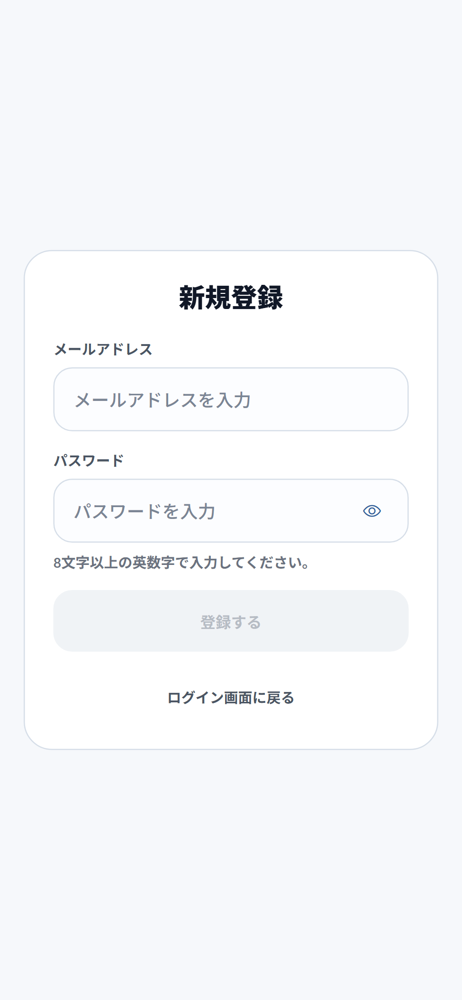
    </td>
    <td align="center">
      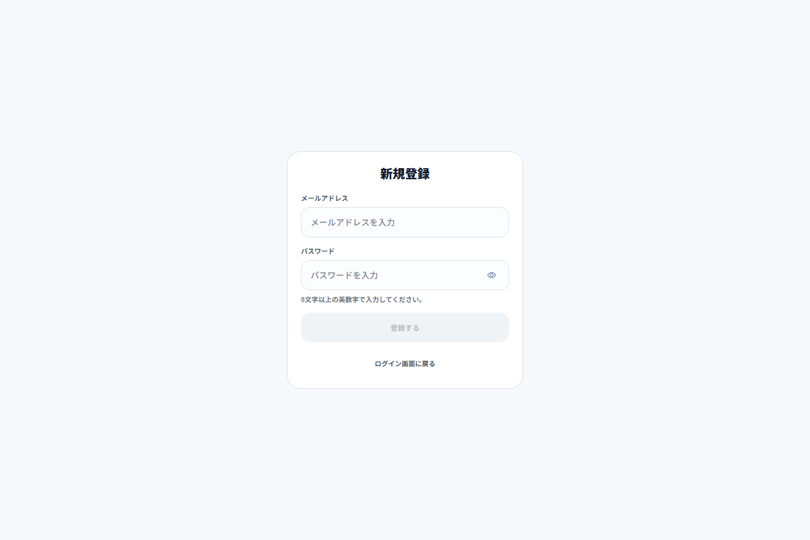
    </td>
  </tr>

  <tr>
    <td><strong>ログイン</strong></td>
    <td align="center">
      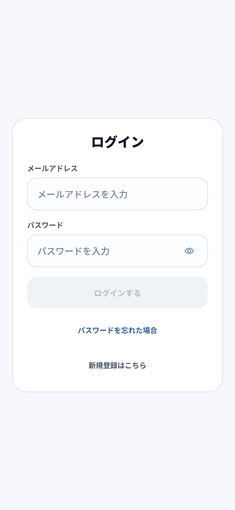
    </td>
    <td align="center">
      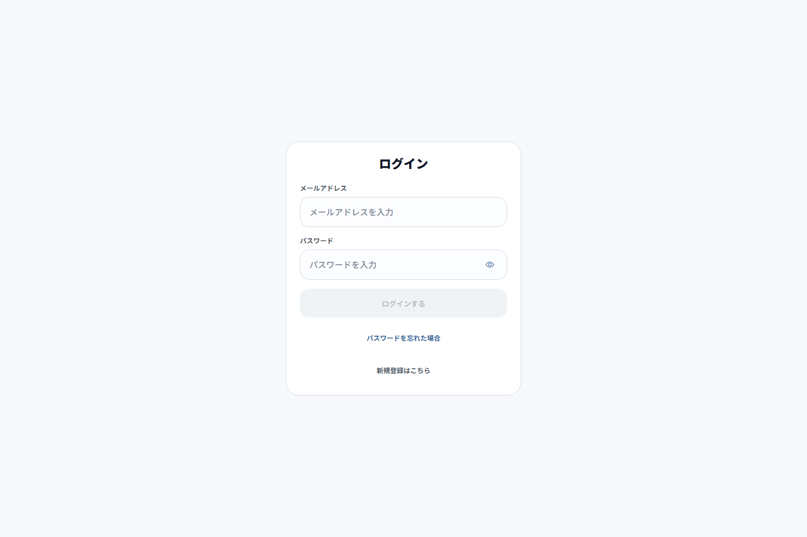
    </td>
  </tr>

  <tr>
    <td><strong>メール確認</strong></td>
    <td align="center">
      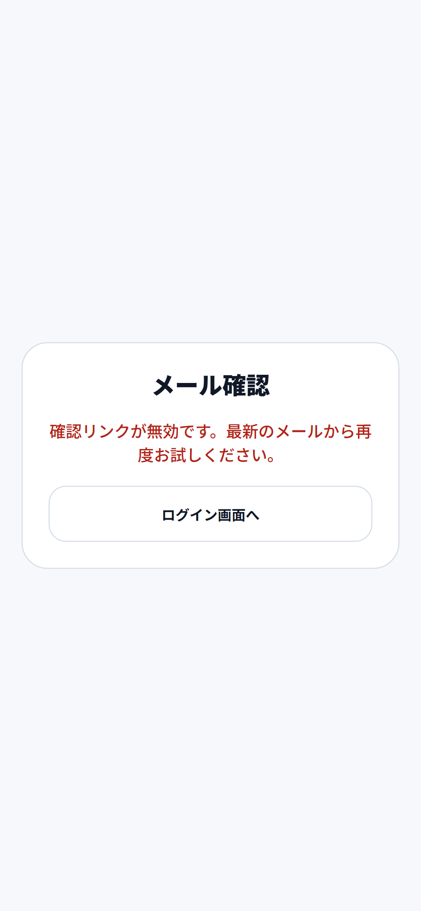
    </td>
    <td align="center">
      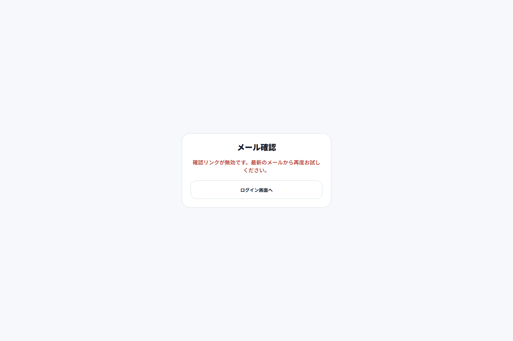
    </td>
  </tr>
</table>

---

<strong>🏢 企業管理</strong>

 

<table>
  <tr>
    <th width="160">画面</th>
    <th align="center">Mobile</th>
    <th align="center">Desktop</th>
  </tr>

  <tr>
    <td>
      <strong>企業一覧</strong> 
      選考状況や志望度を一覧で管理
    </td>
    <td align="center">
      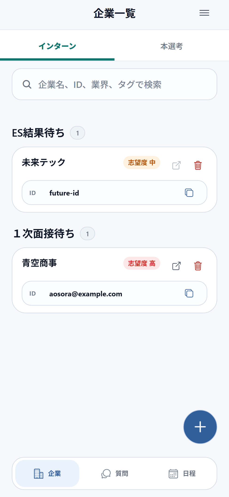
    </td>
    <td align="center">
      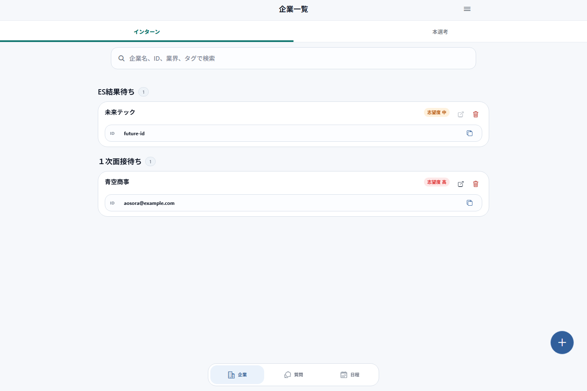
    </td>
  </tr>

  <tr>
    <td>
      <strong>企業追加</strong> 
      企業情報・ログイン情報を登録
    </td>
    <td align="center">
      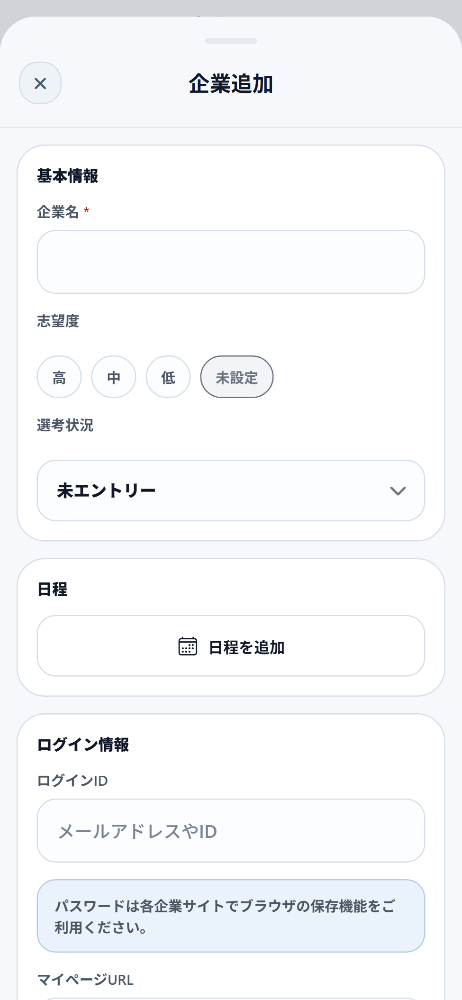
    </td>
    <td align="center">
      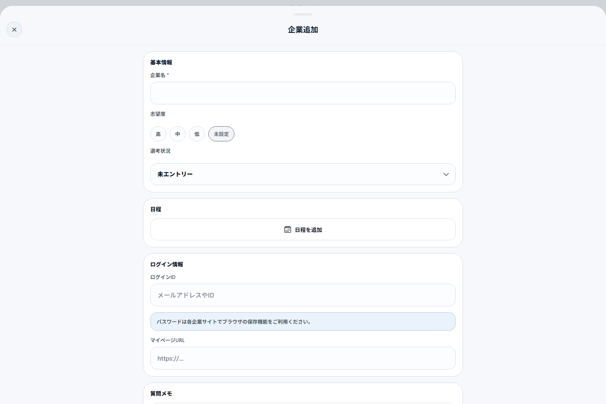
    </td>
  </tr>
</table>

---

<strong>📝 質問管理</strong>

 

<table>
  <tr>
    <th width="160">画面</th>
    <th align="center">Mobile</th>
    <th align="center">Desktop</th>
  </tr>

  <tr>
    <td>
      <strong>質問一覧</strong> 
      企業ごとの質問・回答メモを管理
    </td>
    <td align="center">
      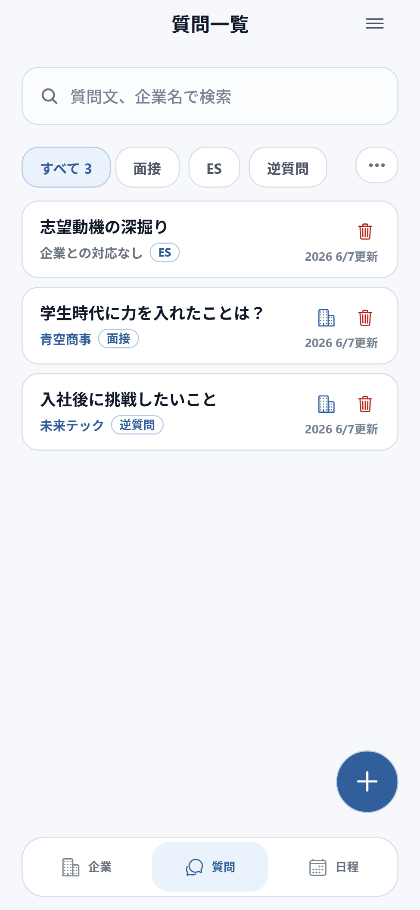
    </td>
    <td align="center">
      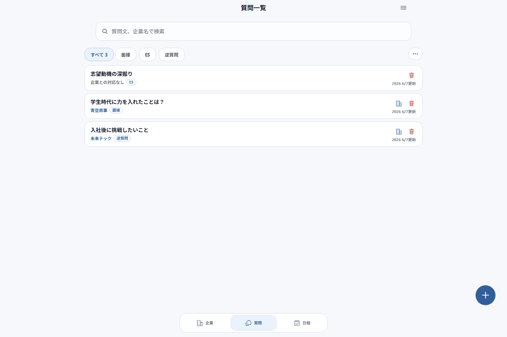
    </td>
  </tr>

  <tr>
    <td>
      <strong>質問追加 1</strong> 
      質問内容・回答方針を入力
    </td>
    <td align="center">
      
    </td>
    <td align="center">
      
    </td>
  </tr>

  <tr>
    <td>
      <strong>質問追加 2</strong> 
      詳細メモやラベルを設定
    </td>
    <td align="center">
      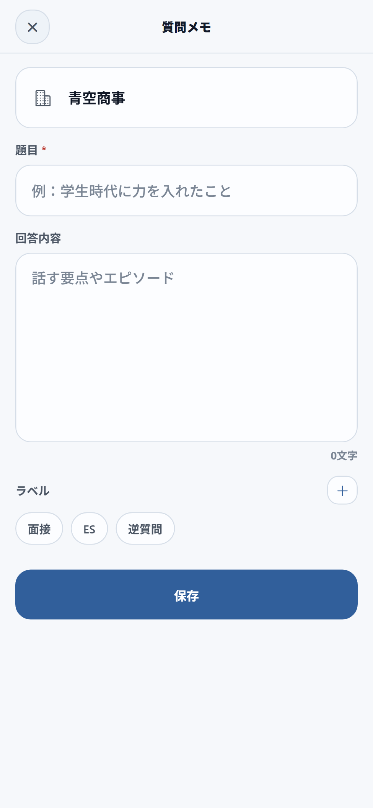
    </td>
    <td align="center">
      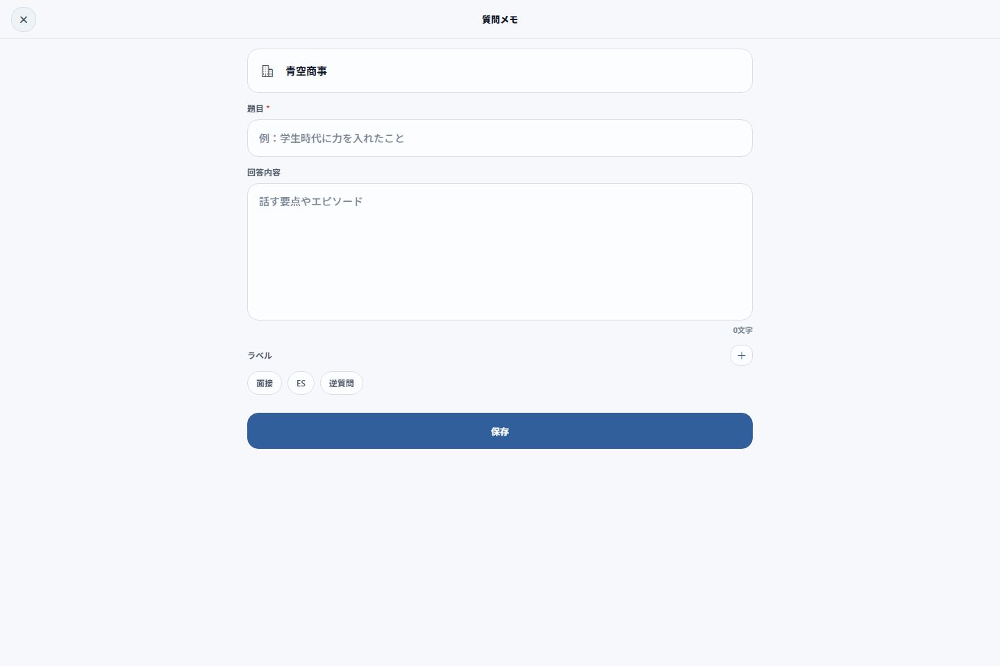
    </td>
  </tr>
</table>

---

<strong>⚙️ 設定・カスタマイズ</strong>

 

<table>
  <tr>
    <th width="160">画面</th>
    <th align="center">Mobile</th>
    <th align="center">Desktop</th>
  </tr>

  <tr>
    <td>
      <strong>サイドメニュー</strong> 
      アカウント情報やログアウト操作
    </td>
    <td align="center">
      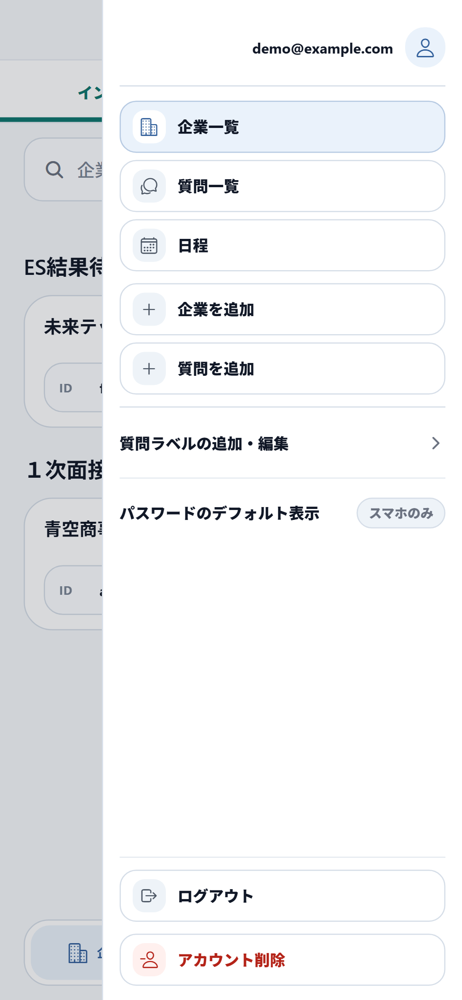
    </td>
    <td align="center">
      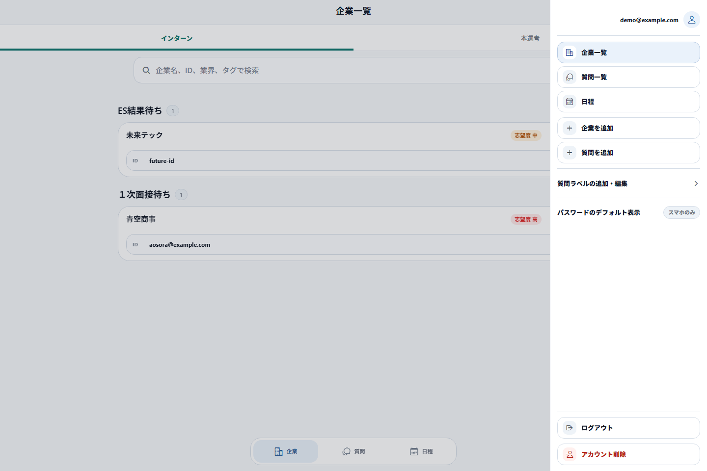
    </td>
  </tr>

  <tr>
    <td>
      <strong>質問ラベル設定</strong> 
      質問を自由に分類できるラベル管理
    </td>
    <td align="center">
      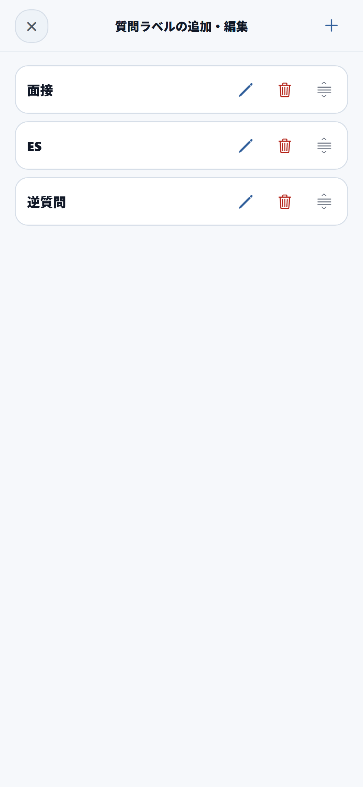
    </td>
    <td align="center">
      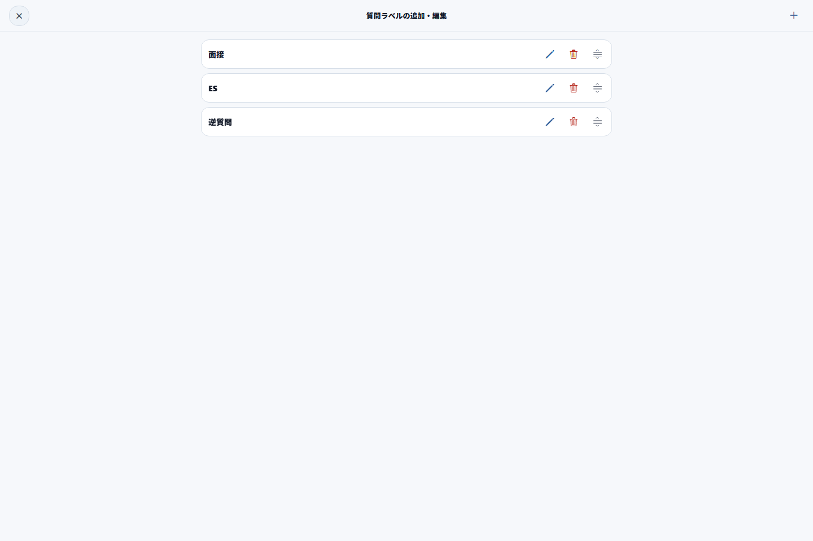
    </td>
  </tr>
</table>

## 使用技術

- React Native / Expo
- React Native Web
- Supabase
- Vercel
