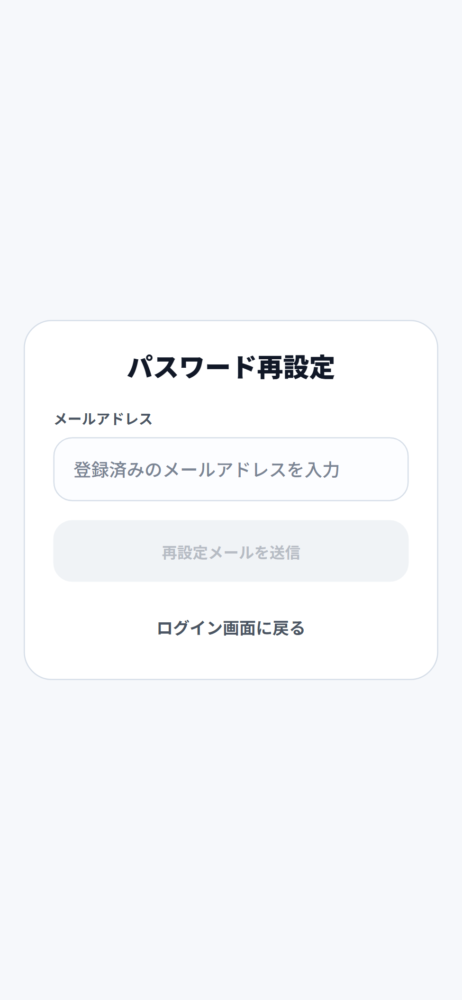
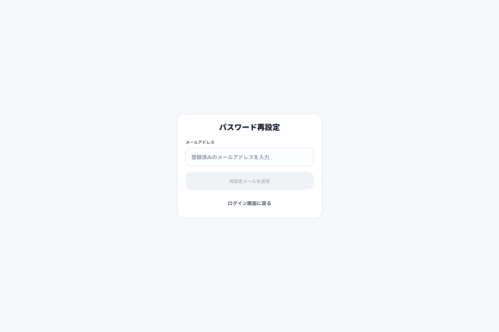
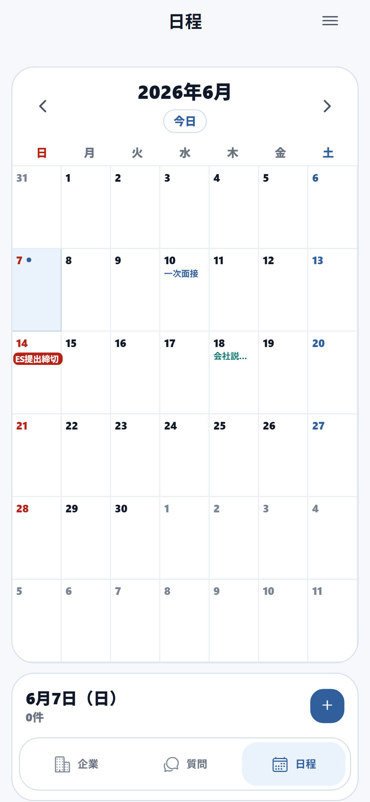
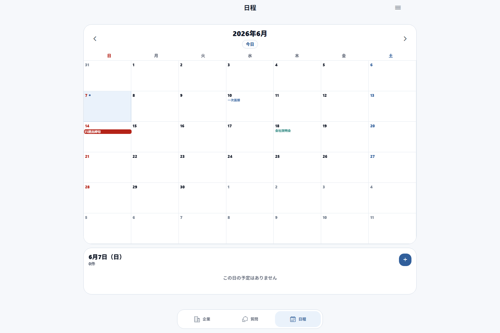
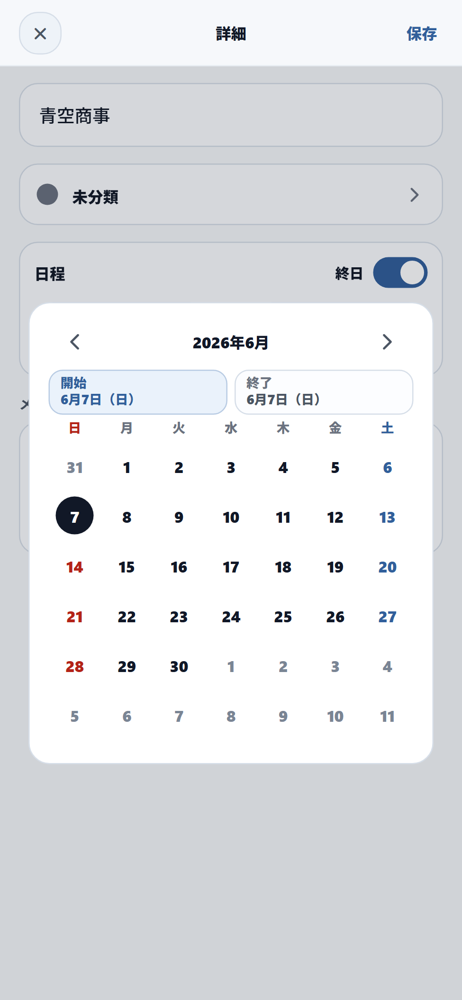
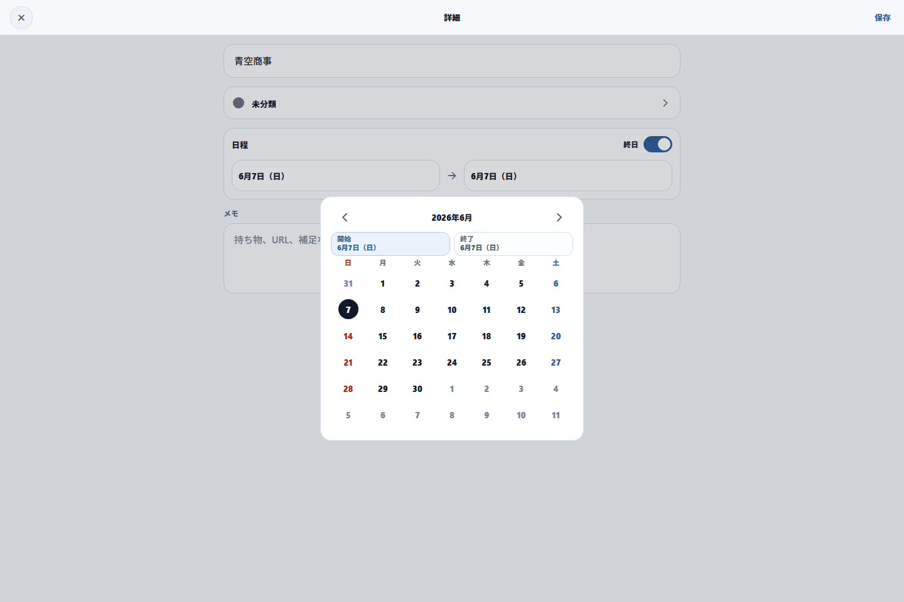

# 就活管理アプリ

就職活動で増えていく応募先、選考状況、質問メモ、面接や締切の日程をまとめて管理するアプリです。
インターンと本選考を切り替えながら、企業ごとの進捗と面接準備に必要な情報を、Web とモバイルの両方から確認できます。

## 概要

このアプリは、就活中に散らばりがちな情報を「企業」「質問」「日程」の3つの画面で整理する個人向け管理ツールです。

企業一覧では応募先を選考状況ごとに確認できます。質問一覧では企業をまたいで面接やES対策用のメモを見返せます。日程画面では面接、説明会、ES締切、Webテストなどの予定をカレンダー形式で管理できます。

## 主な機能

### 企業管理

- インターン / 本選考を切り替えて応募先を管理
- 選考状況、志望度、業界、職種、タグ、自由メモを記録
- 企業ごとのマイページURL、ログインID、パスワード情報を整理
- 企業一覧を選考状況ごとにグルーピング
- 企業名、ログインID、業界、職種、選考状況、タグを対象に検索
- URLを開く、ログインIDやパスワードをコピーする操作に対応

### 質問メモ

- 企業に紐づく質問と回答メモを作成、編集、削除
- 企業未指定の質問メモも登録可能
- 質問文、回答、企業名で検索
- ラベルによる分類とフィルタリング
- タイトル順、追加日、更新日で並び替え
- 質問ラベルの作成、編集、削除、並び替え

### 日程管理

- 下部ナビゲーションから日程タブへ切り替え
- 月間カレンダーで予定を確認
- 選択日の予定一覧を表示
- 企業ごとに予定を作成、編集、削除
- 終日予定、時間指定予定、複数日予定に対応
- 面接、GD、説明会、ES締切、Webテスト、インターン、OB訪問、面談などの予定を管理
- 予定の色カテゴリを作成、編集、削除

### 認証とアカウント

- メールアドレスとパスワードによる新規登録、ログイン
- メールアドレス確認フロー
- 確認メールの再送
- パスワード再設定
- ログアウト
- アカウント削除

### Web / モバイル対応

- Expo / React Native / React Native Web によるクロスプラットフォーム対応
- WebではVercelにデプロイ可能
- iOS / AndroidではExpo SecureStoreを使って企業サイト用パスワードを端末内に保存
- Webでは企業サイト用パスワードを保存せず、ブラウザのパスワード保存機能の利用を想定
- 既存ローカルデータの移行バナーに対応

## 画面構成

- 企業: インターン / 本選考ごとの応募先一覧、企業追加、企業編集
- 質問: 質問メモ一覧、質問作成、ラベルフィルタ、並び替え
- 日程: 月間カレンダー、選択日の予定一覧、予定作成、色カテゴリ管理
- サイドメニュー: 画面切り替え、作成アクション、質問ラベル設定、パスワード表示設定、ログアウト、アカウント削除
- 認証: ログイン、新規登録、メール確認、パスワード再設定

## Screenshots

モバイル / PC の両方に対応した主要画面です。認証、企業、質問、日程、サイドメニュー、設定画面を掲載しています。
スクリーンショット内の企業名や予定は、表示確認用のデモデータです。

---

<details open>
<summary><strong>認証フロー</strong></summary>

<br />

<table>
  <tr>
    <th width="160">画面</th>
    <th align="center">Mobile</th>
    <th align="center">Desktop</th>
  </tr>

  <tr>
    <td><strong>新規登録</strong></td>
    <td align="center">
      
    </td>
    <td align="center">
      
    </td>
  </tr>

  <tr>
    <td><strong>ログイン</strong></td>
    <td align="center">
      
    </td>
    <td align="center">
      
    </td>
  </tr>

  <tr>
    <td><strong>メール確認</strong></td>
    <td align="center">
      
    </td>
    <td align="center">
      
    </td>
  </tr>

  <tr>
    <td><strong>パスワード再設定</strong></td>
    <td align="center">
      
    </td>
    <td align="center">
      
    </td>
  </tr>
</table>

</details>

---

<details open>
<summary><strong>企業管理</strong></summary>

<br />

<table>
  <tr>
    <th width="160">画面</th>
    <th align="center">Mobile</th>
    <th align="center">Desktop</th>
  </tr>

  <tr>
    <td>
      <strong>企業一覧</strong><br />
      <sub>選考状況や志望度を一覧で管理</sub>
    </td>
    <td align="center">
      
    </td>
    <td align="center">
      
    </td>
  </tr>

  <tr>
    <td>
      <strong>企業追加</strong><br />
      <sub>企業情報、ログイン情報、質問メモを登録</sub>
    </td>
    <td align="center">
      
    </td>
    <td align="center">
      
    </td>
  </tr>
</table>

</details>

---

<details open>
<summary><strong>質問管理</strong></summary>

<br />

<table>
  <tr>
    <th width="160">画面</th>
    <th align="center">Mobile</th>
    <th align="center">Desktop</th>
  </tr>

  <tr>
    <td>
      <strong>質問一覧</strong><br />
      <sub>企業をまたいで質問、回答、ラベルを管理</sub>
    </td>
    <td align="center">
      
    </td>
    <td align="center">
      
    </td>
  </tr>

  <tr>
    <td>
      <strong>質問追加 1</strong><br />
      <sub>質問内容と回答メモを入力</sub>
    </td>
    <td align="center">
      
    </td>
    <td align="center">
      
    </td>
  </tr>

  <tr>
    <td>
      <strong>質問追加 2</strong><br />
      <sub>詳細メモやラベルを設定</sub>
    </td>
    <td align="center">
      
    </td>
    <td align="center">
      
    </td>
  </tr>
</table>

</details>

---

<details open>
<summary><strong>日程管理</strong></summary>

<br />

<table>
  <tr>
    <th width="160">画面</th>
    <th align="center">Mobile</th>
    <th align="center">Desktop</th>
  </tr>

  <tr>
    <td>
      <strong>日程カレンダー</strong><br />
      <sub>月間カレンダーと選択日の予定を確認</sub>
    </td>
    <td align="center">
      
    </td>
    <td align="center">
      
    </td>
  </tr>

  <tr>
    <td>
      <strong>予定追加</strong><br />
      <sub>終日/時間指定の予定と色カテゴリを設定</sub>
    </td>
    <td align="center">
      
    </td>
    <td align="center">
      
    </td>
  </tr>
</table>

</details>

---

<details open>
<summary><strong>メニューと設定</strong></summary>

<br />

<table>
  <tr>
    <th width="160">画面</th>
    <th align="center">Mobile</th>
    <th align="center">Desktop</th>
  </tr>

  <tr>
    <td>
      <strong>サイドメニュー</strong><br />
      <sub>画面切り替え、作成、ログアウト、アカウント削除</sub>
    </td>
    <td align="center">
      
    </td>
    <td align="center">
      
    </td>
  </tr>

  <tr>
    <td>
      <strong>質問ラベル設定</strong><br />
      <sub>質問を自由に分類できるラベル管理</sub>
    </td>
    <td align="center">
      
    </td>
    <td align="center">
      
    </td>
  </tr>
</table>

</details>

## 使用技術

- Expo SDK 54
- React 19
- React Native 0.81
- React Native Web
- TypeScript
- Supabase Auth / Database
- Vercel Serverless Functions
- Expo SecureStore
- AsyncStorage
- FlashList
- React Native Gesture Handler / Reanimated

## データ構成

Supabaseには次のテーブルを作成します。RLSを有効にし、各ユーザーが自分のデータだけを操作できるようにしています。

- `companies`: 企業情報、選考状況、志望度、タグ、メモ、マイページURL、ログインID
- `company_schedules`: 企業に紐づく日程
- `schedule_categories`: 日程の色カテゴリ
- `question_memos`: 質問と回答メモ
- `question_labels`: 質問ラベル
- `question_memo_labels`: 質問メモとラベルの関連

企業サイト用パスワードはSupabaseへ保存しません。iOS / Androidでは端末内のSecureStoreへ保存し、Webでは保存対象から外しています。

## セットアップ

### 1. 依存関係をインストール

```powershell
npm install
```

### 2. 環境変数を作成

```powershell
Copy-Item .env.example .env
```

`.env` にSupabaseとVercel APIの値を設定します。

```env
EXPO_PUBLIC_API_BASE_URL=https://your-production-domain.vercel.app
EXPO_PUBLIC_SUPABASE_URL=https://your-project.supabase.co
EXPO_PUBLIC_SUPABASE_ANON_KEY=your-supabase-anon-public-key
EXPO_PUBLIC_WEB_BASE_URL=https://your-production-domain.vercel.app
EXPO_PUBLIC_CONFIRM_EMAIL_REDIRECT_URL=https://your-production-domain.vercel.app/auth/confirm
EXPO_PUBLIC_RESET_PASSWORD_REDIRECT_URL=https://your-production-domain.vercel.app/auth/reset-password
EXPO_PUBLIC_NATIVE_AUTH_CALLBACK_URL=syuukatu://auth/callback

SUPABASE_URL=https://your-project.supabase.co
SUPABASE_ANON_KEY=your-supabase-anon-public-key
SUPABASE_SERVICE_ROLE_KEY=your-supabase-service-role-key
WEB_BASE_URL=https://your-production-domain.vercel.app
CONFIRM_EMAIL_REDIRECT_URL=https://your-production-domain.vercel.app/auth/confirm
RESET_PASSWORD_REDIRECT_URL=https://your-production-domain.vercel.app/auth/reset-password
```

### 3. Supabaseのスキーマを適用

Supabase SQL Editorなどで `supabase/schema.sql` を実行します。
差分管理を使う場合は `supabase/migrations` のSQLを順番に適用してください。

Supabase AuthのRedirect URLには、少なくとも次を登録します。

- `https://your-production-domain.vercel.app/auth/confirm`
- `https://your-production-domain.vercel.app/auth/reset-password`
- `syuukatu://auth/callback`

### 4. 開発サーバーを起動

```powershell
npm run web
```

モバイルで確認する場合は、Expoの標準コマンドを使います。

```powershell
npm run android
npm run ios
```

## Scripts

| コマンド | 内容 |
| --- | --- |
| `npm run start` | Expo開発サーバーを起動 |
| `npm run web` | Web版を起動 |
| `npm run android` | Android向けに起動 |
| `npm run ios` | iOS向けに起動 |
| `npm run typecheck` | TypeScriptの型チェック |
| `npm run doctor` | Expo Doctorを実行 |

## API

Vercel Functionsとして `api` 配下にAPIを配置しています。

- `/api/health`: ヘルスチェック
- `/api/auth/session`: セッション確認
- `/api/auth/sign-in`: ログイン
- `/api/auth/sign-up`: 新規登録
- `/api/auth/sign-out`: ログアウト
- `/api/auth/reset-password`: パスワード再設定メール送信
- `/api/auth/resend-confirmation`: 確認メール再送
- `/api/companies`: 企業、日程、日程カテゴリの取得、保存、削除
- `/api/questions`: 質問メモと質問ラベルの取得、質問メモの保存、削除
- `/api/question-labels`: 質問ラベルの作成、編集、並び替え、削除

## デプロイ

Vercel向けの設定は `vercel.json` に含まれています。

- Build Command: `npx expo export -p web`
- Output Directory: `dist`
- API以外のルートは `index.html` にrewrite

Vercel側にも `.env.example` と同じ環境変数を設定してください。モバイルアプリからAPIへ接続する場合、`EXPO_PUBLIC_API_BASE_URL` には保護されていないProduction URLを設定します。

## 開発メモ

- アプリ本体の入口は `App.tsx` です。
- ホーム画面の中心は `src/features/home/HomeScreen.tsx` です。
- 企業、質問、日程の型定義は `src/features/home/types.ts` にあります。
- 共通UI部品は `src/ui` にあります。
- Supabaseのテーブル定義は `supabase/schema.sql` にあります。
