# 就活管理アプリ

企業の選考状況、面接で使う質問メモ、説明会や締切の日程をひとつにまとめるWebアプリです。
散らばりやすい就職活動の情報を、企業・質問・日程の3つの画面からすぐに確認できます。

## 主な機能

| 企業 | 質問 | 日程 |
| --- | --- | --- |
| 応募先を選考状況ごとに整理。ログイン情報、メモ、質問、予定も企業ごとにまとめられます。 | 面接やESで使う質問と回答を記録。企業やラベルで分類し、必要なメモをすぐに探せます。 | 面接、説明会、提出期限などを月間カレンダーで管理。日時や色を設定して見やすく整理できます。 |

- インターン／本選考の切り替え、検索、絞り込み、並び替えに対応
- 企業と質問メモは、複数選択してまとめて削除可能
- 新規登録、ログイン、メール確認、パスワード再設定、アカウント削除に対応
- システム設定に合わせてライトモード／ダークモードを切り替え

## 画面イメージ

掲載している企業名、メールアドレス、質問、予定はすべて表示確認用の架空データです。

### 3つのメイン画面

<table>
  <tr>
    <th align="center">企業</th>
    <th align="center">質問</th>
    <th align="center">日程</th>
  </tr>
  <tr>
    <td align="center">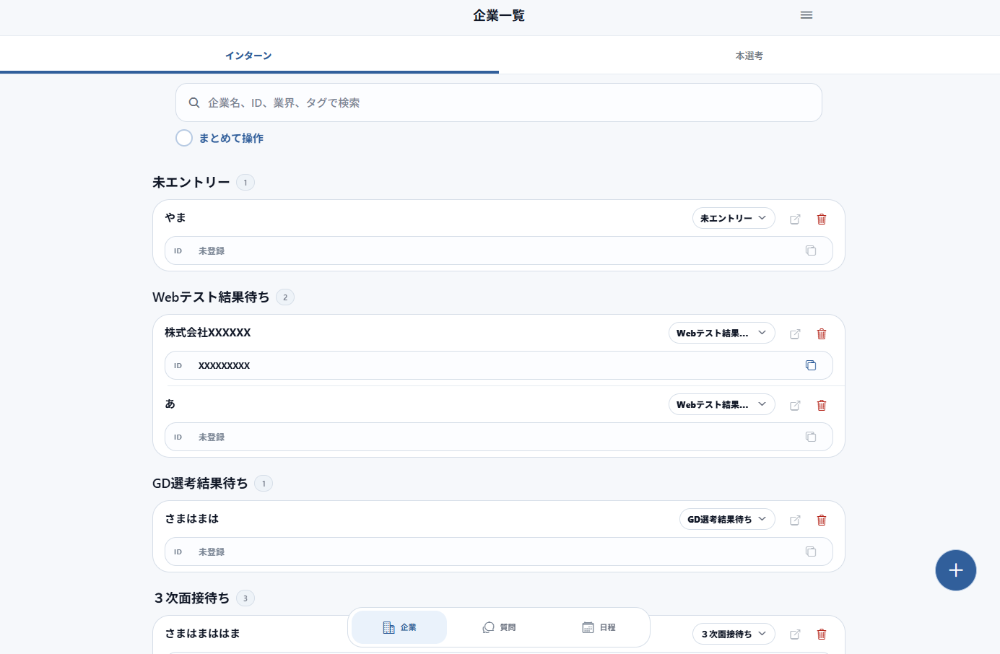</td>
    <td align="center">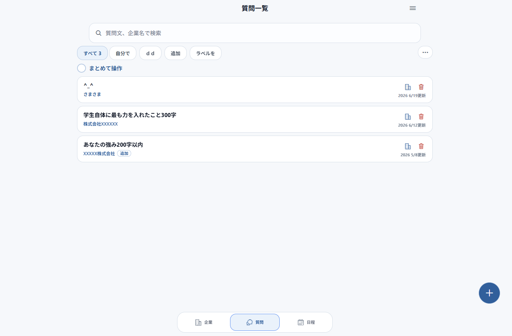</td>
    <td align="center">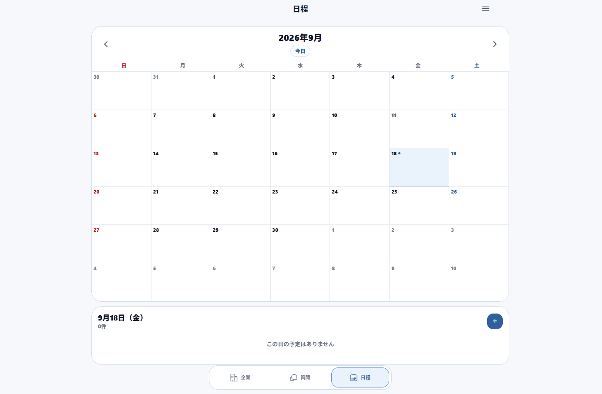</td>
  </tr>
</table>

<strong>企業の登録と管理</strong>

 

<table>
  <tr>
    <td align="center">
      <strong>追加方法を選択</strong>  
      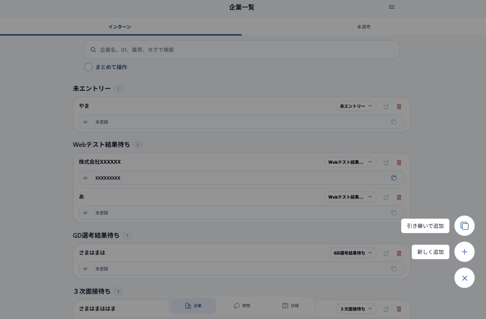
    </td>
    <td align="center">
      <strong>企業情報をまとめて編集</strong>  
      
    </td>
  </tr>
  <tr>
    <td align="center" colspan="2">
      <strong>複数の企業をまとめて操作</strong>  
      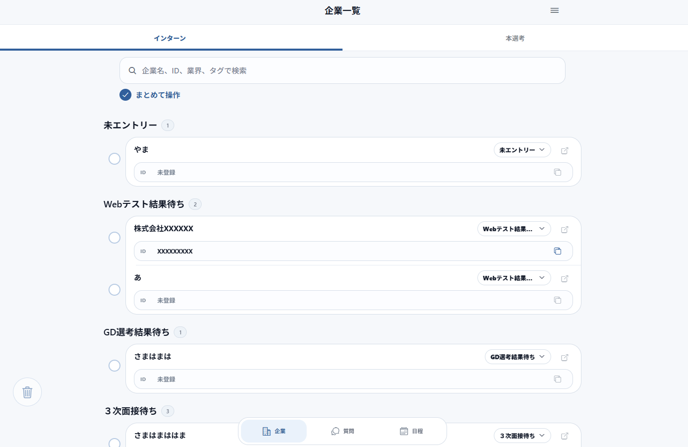
    </td>
  </tr>
</table>

<strong>質問メモとラベル</strong>

 

<table>
  <tr>
    <td align="center">
      <strong>質問と回答を記録</strong>  
      
    </td>
    <td align="center">
      <strong>ラベルで整理</strong>  
      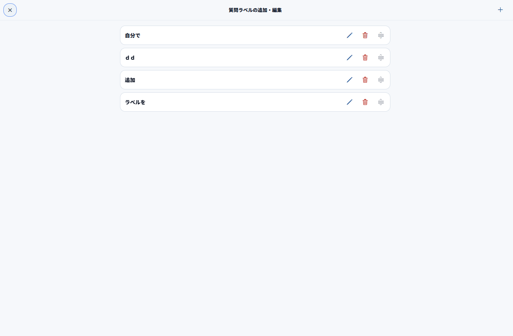
    </td>
  </tr>
</table>

<strong>予定と色カテゴリ</strong>

 

<table>
  <tr>
    <td align="center">
      <strong>予定を追加・編集</strong>  
      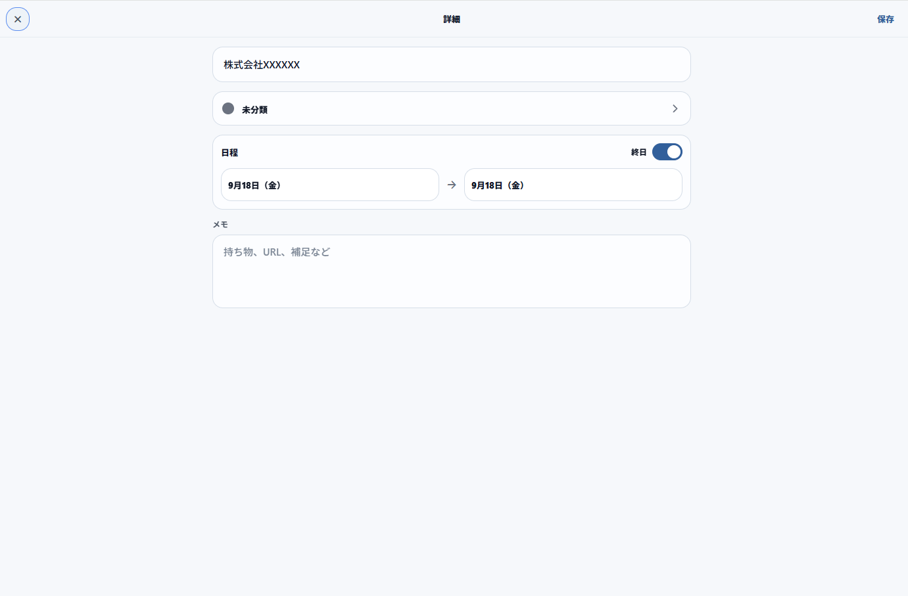
    </td>
    <td align="center">
      <strong>期間をカレンダーから選択</strong>  
      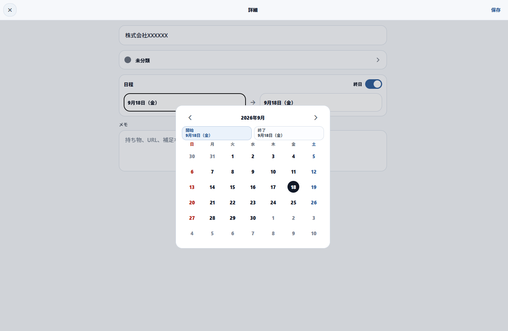
    </td>
  </tr>
  <tr>
    <td align="center">
      <strong>色カテゴリを管理</strong>  
      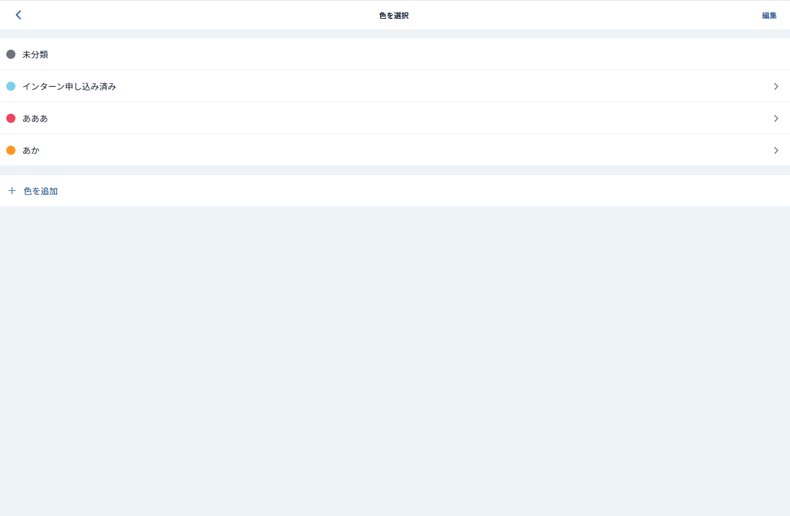
    </td>
    <td align="center">
      <strong>好きな色で分類</strong>  
      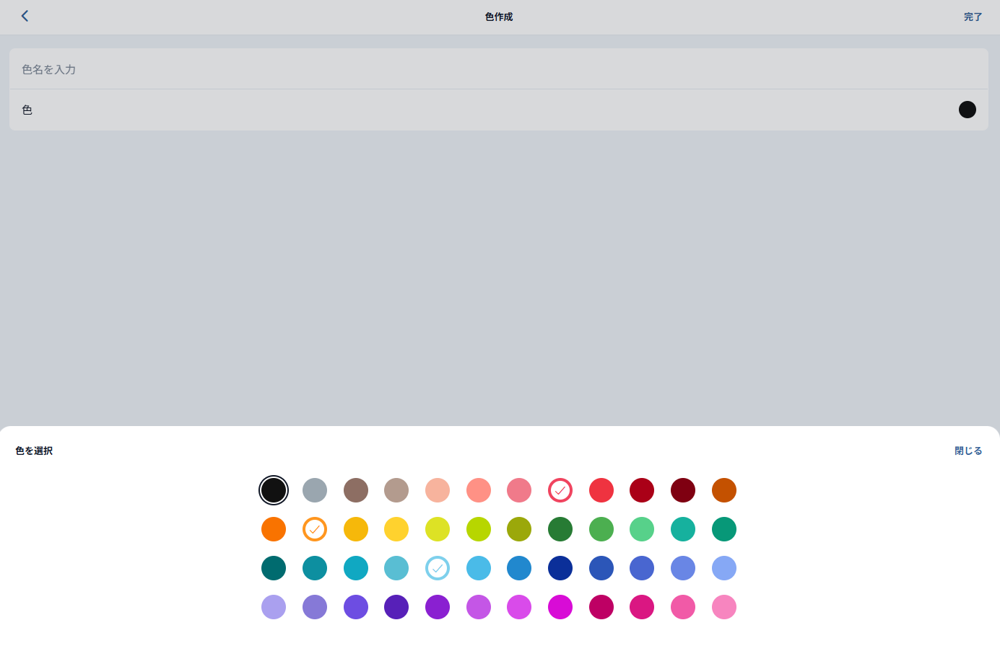
    </td>
  </tr>
</table>

<strong>ログインとメニュー</strong>

 

<table>
  <tr>
    <td align="center">
      <strong>ログイン</strong>  
      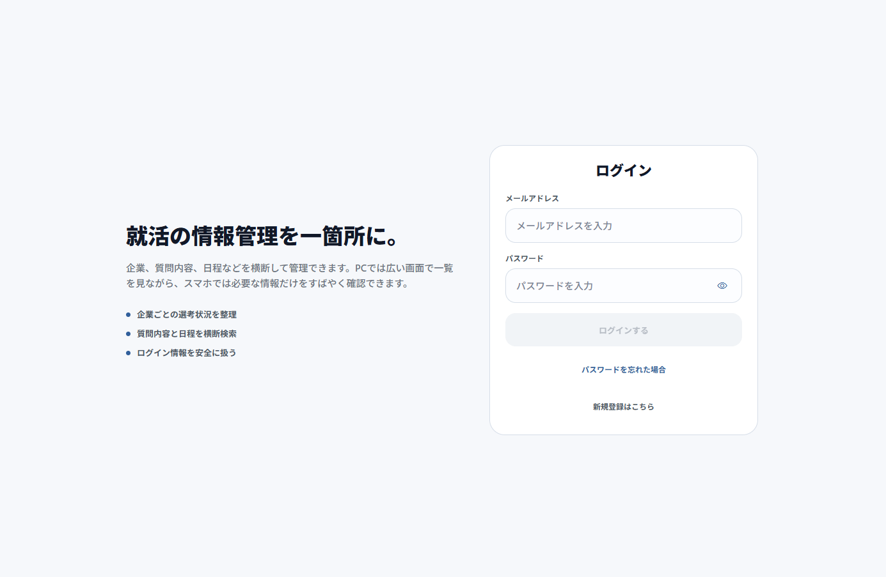
    </td>
    <td align="center">
      <strong>サイドメニュー</strong>  
      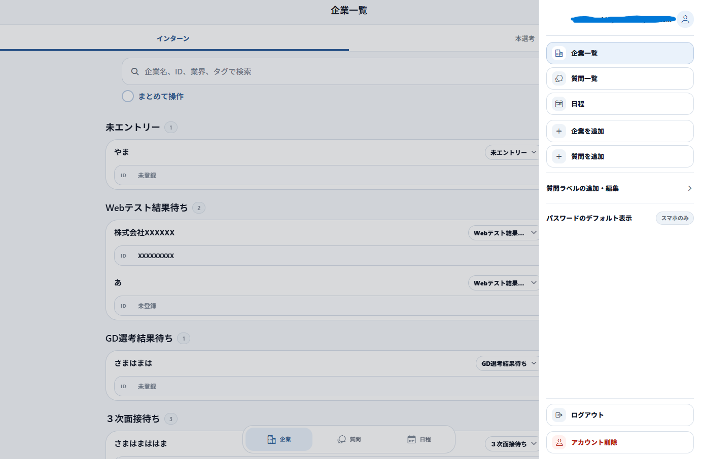
    </td>
  </tr>
</table>

